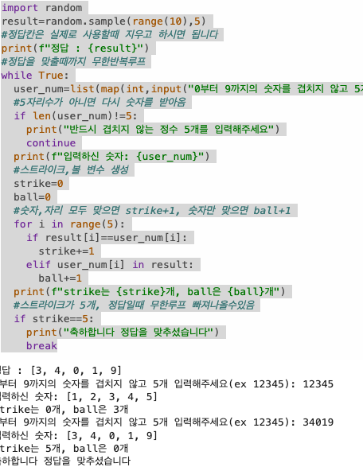
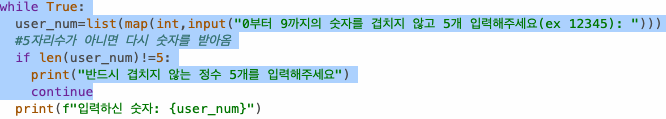

# AIFFEL Campus Online Code Peer Review Templete
- 코더 : 김규빈
- 리뷰어 : 박의진

# # PRT(Peer Review Template)
- [X]  **1. 주어진 문제를 해결하는 완성된 코드가 제출되었나요?**
    - 네, 'result = random.sample(range(10),5)'로 중복 없는 5자리 정답을 생성했습니다. 
    - strike/ball 계산과 strike 5개 정답 맞췄을 때 종료까지 구현이 되었습니다.
    - 게임 로직도 정상 동작합니다.
       
    
- [X]  **2. 전체 코드에서 가장 핵심적이거나 가장 복잡하고 이해하기 어려운 부분에 작성된 
주석 또는 doc string을 보고 해당 코드가 잘 이해되었나요?**
    - 핵심 로직은 'for'반복문 내부의 **strike/ball 판정** 부분입니다. 
    - " "으로 주석이 잘 적혀져 있고, 코드를 이해하기 좋습니다.
    - 출력 메시지로 사용자에게 작성 가이드라인을 직관적으로 안내한 점이 좋았습니다. 
    -
      
        
- [X]  **3. 에러가 난 부분을 디버깅하여 문제를 해결한 기록을 남겼거나
새로운 시도 또는 추가 실험을 수행해봤나요?**
    - 디버깅한 기록이나 추가 실험에 대한 기록은 남기지 않은 것으로 보입니다.
    - 현재 중복 입력 자체를 막는 기능은 "반드시 겹치지 않는 정수 5개를 입력해주세요"라는 출력 안내를 통해 방지하였습니다. 
    - 하지만 잘못된 중복 숫자에 대한 검증은 구현이 안되었으므로 (중복 입력해도 코드 길이가 5면 넘어감.) 조건문 추가로 보완이 가능해볼 수 있습니다.  
    - **개선 아이디어**: 조건을 추가해 중복 입력을 막을 수 있습니다.
    ---
    - 예) if len(set(user_num) != 5:
             print(" 중복 없는 숫자를 입력해주세요.")
             continue
    ---  
        
- [X]  **4. 회고를 잘 작성했나요?**
    - 배운점 : 'random.sample'을 이용해 간단하게 중복 없는 정답 생성이 가능, 최소한의 조건문으로 구현하여 효율적임.
    - 아쉬운점 : 입력값 검증 시 숫자가 아닌 입력이나 중복 입력을 걸러내지 못하는 점
    - 느낀점 : 입력 검증만 강화하면 사용자 친화적 코드라고 생각합니다. 함수를 이용해 구분화하면 전체 로직이 나중에 재사용 및 수정 시 용이할 듯 합니다. 
    
        
- [X]  **5. 코드가 간결하고 효율적인가요?**
    - PEP8는 아직 저도 잘 알지 못하여 판단이 어렵지만, 간결하게 작성되어 한번에 실행될 수 있게 작성이 된 듯합니다. 
    - 코드 작성 시 한칸 공백 규칙을 적용하면 읽기가 좀 더 수월할 듯합니다. 
    - 다만 함수 기능을 이용해 모듈화한다면 범용적으로 나중에 수정 및 재사용이 용이해질 듯 합니다
      

# 회고(참고 링크 및 코드 개선)
```
# 리뷰어의 회고를 작성합니다.
# 코드 리뷰 시 참고한 링크가 있다면 링크와 간략한 설명을 첨부합니다.
# 코드 리뷰를 통해 개선한 코드가 있다면 코드와 간략한 설명을 첨부합니다.

```


```python

```
